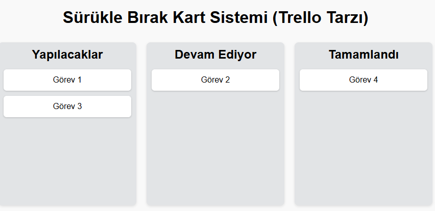

# 🗂️ Sürükle Bırak Yapılabilir Kart Sistemi (Trello Style Drag & Drop Board)  

Bu proje, sürükle-bırak (drag & drop) özelliği ile görev kartlarının farklı sütunlar arasında taşınabildiği basit bir Trello benzeri uygulamadır.

---

## 🎯 Projenin Amacı

- HTML5 Drag & Drop API kullanarak kullanıcı etkileşimi sağlamak
- Dinamik olarak öğelerin taşınmasını yönetmek
- Kullanıcı arayüzünde kolay görev yönetimi sağlamak

---

## 🚀 Özellikler

- Kartların sürüklenip bırakılması
- Sütunların sürükleme esnasında görsel olarak tepki vermesi
- Kolay görev taşıma ve düzenleme

---

## 🛠️ Kullanılan Teknolojiler

- HTML5 Drag & Drop API
- CSS (esnek düzen, görsel efektler)
- JavaScript (DOM manipulation ve event handling)

---

## 👥 Ekip / Kaynaklar

- Geliştirici: [ Quenn Exe ]
- Kaynaklar:
  - [HTML Drag and Drop API - MDN](https://developer.mozilla.org/en-US/docs/Web/API/HTML_Drag_and_Drop_API)
  - [Drag and Drop Tutorial](https://www.w3schools.com/html/html5_draganddrop.asp)

---

## 📌 Kazanımlar

- Kullanıcı deneyimini artıran sürükle bırak etkileşimleri geliştirme
- HTML5 API'lerini efektif kullanma
- Dinamik DOM güncellemeleri ve olay yönetimi becerileri kazanma

> 🗂️ Bu proje, karmaşık kullanıcı arayüzlerini yönetme ve interaktif web uygulamaları geliştirme konusunda büyük bir adım attırır.

# 🖼️ Arayüz Görünümü,

|  |