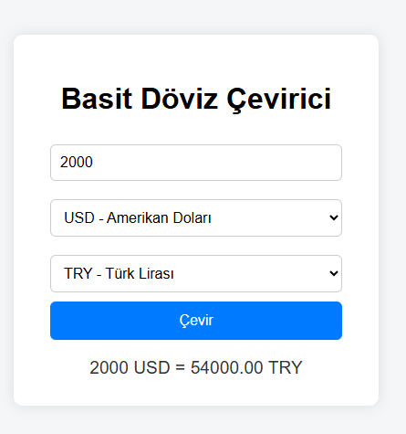

# 💱 Basit Döviz Çevirici (Simple Currency Converter)

Bu proje, kullanıcıların farklı para birimleri arasında hızlıca dönüşüm yapmalarını sağlar.

---

## 🎯 Projenin Amacı

- Temel matematiksel işlemler ve kullanıcı girdisiyle çalışma
- Seçim kutuları (select) kullanarak dinamik veri işlemleri
- Basit arayüzle kullanıcı deneyimini artırma

---

## 🚀 Özellikler

- Kullanıcı tarafından girilen miktarı seçilen para biriminden diğerine dönüştürme
- Kolay ve sade tasarım
- Anlık dönüşüm sonucu gösterme

---

## 🛠️ Kullanılan Teknolojiler

- HTML, CSS, JavaScript

---

---

## 👥 Ekip / Kaynaklar

- Geliştirici: [ Quenn Exe ]
- Kaynaklar:
  - Döviz kurları sabit örnek olarak eklendi, gerçek API entegrasyonu geliştirilebilir.

---

## 📌 Kazanımlar

- JavaScript ile kullanıcı girdisini alma ve işleme
- Basit matematiksel dönüşümler yapma
- DOM manipülasyonu ve olay yönetimi (event handling)

> 💱 Bu proje, finansal uygulamalarda temel kullanıcı girdisi ve veri işleme becerilerinizi geliştirmenize katkı sağlar.
# 🖼️ Arayüz Görünümü,

|  |