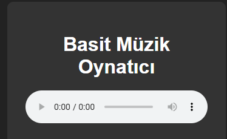

# 🎵 Basit Müzik Oynatıcı (Music Player)

Bu proje, HTML5 audio elementini kullanarak basit bir müzik oynatıcı oluşturmayı sağlar.

---

## 🎯 Projenin Amacı

- HTML5 audio API kullanımı
- Basit medya oynatma kontrolü
- Kullanıcıya temel müzik oynatma deneyimi sağlama

---

## 🚀 Özellikler

- Yerel veya uzaktaki mp3 dosyalarının oynatılması
- Oynatma, durdurma, ses kontrolü gibi standart özellikler

---

## 🛠️ Kullanılan Teknolojiler

- HTML, CSS, JavaScript
- HTML5 Audio Elementi

---

---

## 👥 Ekip / Kaynaklar

- Geliştirici: [ Quenn Exe ]
- Kaynaklar:
  - MDN Web Docs - HTML5 Audio API

---

## 📌 Kazanımlar

- HTML5 medya oynatma altyapısını öğrenme
- Web üzerinde ses kontrolü
- Basit kullanıcı arayüzü tasarımı

> 🎵 Bu proje, medya uygulamalarına giriş için mükemmel bir başlangıçtır.
# 🖼️ Arayüz Görünümü,

|  |