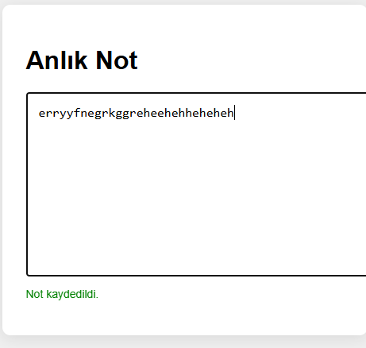

# 📝 Anlık Not Alma Uygulaması / Live Note App with localStorage

Bu proje, kullanıcı yazdıkça verilerin anlık olarak tarayıcıda localStorage’a kaydedildiği bir not uygulamasıdır. Sayfa yenilense bile veri kaybolmaz.

---

## 🎯 Projenin Amacı

- localStorage kullanımını öğretmek.
- Anlık veri işleme ve veri saklama temellerini göstermek.
- Kullanıcı deneyimini geliştiren otomatik kayıt özelliğini uygulamak.

---

## 🚀 Özellikler

- Notlar otomatik kaydedilir.
- Sayfa yenilense bile notlar silinmez.
- Basit ve sade arayüz.

---

## 🛠️ Kullanılan Teknolojiler

- **HTML5**
- **CSS3**
- **JavaScript (localStorage)**

---

---

## 👥 Ekip / Kaynaklar

- Geliştirici: [Quenn Exe]
- Kaynak: MDN Web Docs - [https://developer.mozilla.org/en-US/docs/Web/API/Window/localStorage](https://developer.mozilla.org/en-US/docs/Web/API/Window/localStorage)

---

## 📌 Kazanımlar

- Tarayıcı içi veri saklama (localStorage)
- `input` olaylarını dinleme ve gerçek zamanlı kayıt yapma
- Kullanıcı dostu geri bildirim mekanizmaları

> 🧠 Bu proje, frontend geliştiricilerine veri sürekliliği kavramını öğretir. Sayfa yeniden yüklense bile veri kaybı yaşanmayan uygulamalar geliştirmek için temel bir örnektir.

# 🖼️ Arayüz Görünümü,

|  |