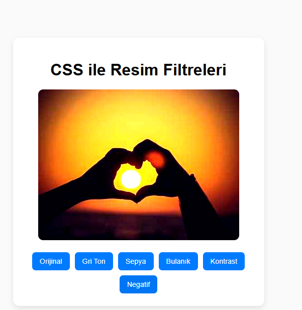

# 🖼️ Resim Filtre Uygulaması (CSS ile)

Bu proje, CSS filtreleri kullanarak bir resme farklı efektler uygulamayı sağlar.

---

## 🎯 Projenin Amacı

- CSS filtrelerini öğrenmek ve uygulamak
- Kullanıcı etkileşimli arayüz geliştirmek
- Görsel efektlerle kullanıcı deneyimini artırmak

---

## 🚀 Özellikler

- Gri ton, sepya, bulanık, kontrast ve negatif filtreler
- Butonlarla filtre seçimi
- Geçişli efektlerle görsel yumuşatma

---

## 🛠️ Kullanılan Teknolojiler

- HTML, CSS, JavaScript
- CSS Filter Property

---

## 👥 Ekip / Kaynaklar

- Geliştirici: [ Quenn Exe ]
- Kaynaklar:
  - MDN Web Docs - CSS Filter Effects

---

## 📌 Kazanımlar

- CSS filtre efektlerinin kullanımı
- Basit JavaScript ile stil değiştirme
- Etkileşimli kullanıcı arayüzü tasarımı

> 🖼️ Bu proje, görsel tasarımda yaratıcılığınızı ortaya koymak ve CSS’nin gücünü keşfetmek için idealdir.

# 🖼️ Arayüz Görünümü,

|  |