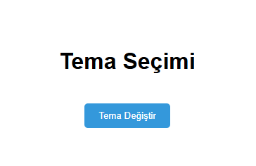

# 🌗 Sayfa Teması & Kullanıcı Tercihini Kaydetme  

Bu proje, kullanıcıların seçtiği tema (gece/gündüz) tercihinin localStorage ile kaydedildiği basit ama etkili bir tema geçiş sistemidir.

## 🎯 Projenin Amacı

- Kullanıcı deneyimini kişiselleştirmeyi öğretmek.
- Tema geçiş sistemlerinin nasıl yapıldığını anlamak.
- localStorage ile kullanıcı tercihlerini kaydetmek.

## 🚀 Özellikler

- Gece/Gündüz teması
- localStorage ile kalıcı tercih
- Kullanıcı arayüzü üzerinde anında değişim

## 🛠️ Kullanılan Teknolojiler

- HTML5  
- CSS3  
- JavaScript (localStorage)

## 👥 Ekip / Kaynaklar

- Geliştirici: [Quenn Exe]
- Kaynaklar:
  - [MDN localStorage](https://developer.mozilla.org/en-US/docs/Web/API/Window/localStorage)
  - [CSS Transition](https://developer.mozilla.org/en-US/docs/Web/CSS/transition)

## 📌 Kazanımlar

- Kullanıcı tercihlerine saygı duyan UI tasarımı
- Tema sistemleri geliştirme yeteneği
- localStorage ve DOM manipülasyon pratiği

# 🖼️ Arayüz Görünümü,

|  |

