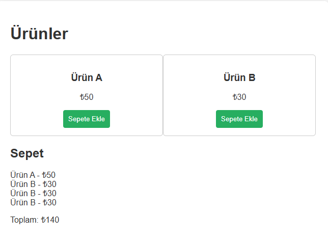

# 🛒 Basit Alışveriş Sepeti  

**English:** Simple Shopping Cart

Bu proje, temel JavaScript kullanarak çalışan bir alışveriş sepeti sistemini temsil eder. Ürün ekleme ve toplam tutarı güncelleme gibi temel fonksiyonları içerir.

---

## 🎯 Projenin Amacı

- DOM üzerinden dinamik içerik güncellemeyi öğrenmek
- Kullanıcı etkileşimiyle çalışan bir uygulama geliştirmek
- Dizi işlemleri ve toplam hesaplama pratiği kazanmak

---

## 🚀 Özellikler

- Ürünleri sepete ekleyebilme
- Dinamik toplam fiyat hesaplama
- Sade ve işlevsel kullanıcı arayüzü

---

## 🛠️ Kullanılan Teknolojiler

- HTML5  
- CSS3  
- JavaScript (Vanilla JS)

## 👥 Ekip / Kaynaklar

- Geliştirici: [Quenn Exe ]
- İlham: JavaScript başlangıç projeleri

---

## 📌 Kazanımlar

- Kullanıcıdan gelen verilerle işlem yapma (event handling)
- DOM elemanlarını oluşturma ve değiştirme
- Basit veri yapılarıyla (diziler, nesneler) çalışma

> 🧩 Bu proje, e-ticaret veya kullanıcı etkileşimi odaklı web uygulamaları geliştirmeye başlamak isteyenler için mükemmel bir temel sunar.

# 🖼️ Arayüz Görünümü,

|  |
