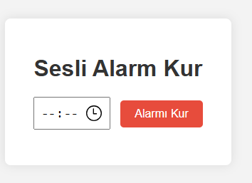

# 🔔 Sesli Alarm Kurma Uygulaması  
**English:** Sound Alarm App

Bu proje, kullanıcıların istedikleri saate alarm kurmalarını sağlayan basit bir web uygulamasıdır. Belirlenen zamanda sesli uyarı verir.

---

## 🎯 Projenin Amacı

- Tarih ve saat işlemleri yapmak
- `setTimeout` fonksiyonu ile zamanlayıcı oluşturmak
- Kullanıcı girdisi alıp işlem yapmak
- HTML5 audio elementini kullanmak

---

## 🚀 Özellikler

- Alarm zamanı belirleme
- Geçmiş zaman seçilirse bir sonraki güne otomatik ayarlama
- Alarm zamanı geldiğinde ses çalma ve görsel uyarı

---

## 🛠️ Kullanılan Teknolojiler

- HTML5  
- CSS3  
- JavaScript (Date, setTimeout, Audio)

---

---

## 👥 Ekip / Kaynaklar

- Geliştirici: [ Quenn Exe ]
- Kaynaklar:
  - [Date - MDN](https://developer.mozilla.org/en-US/docs/Web/JavaScript/Reference/Global_Objects/Date)
  - [HTMLAudioElement - MDN](https://developer.mozilla.org/en-US/docs/Web/API/HTMLAudioElement)

---

## 📌 Kazanımlar

- Zaman hesaplama ve yönetimi
- Event-driven programlama ve zamanlayıcı kullanımı
- Medya elementleri ile etkileşim

> 🔔 Bu proje, günlük hayatınızda kullanabileceğiniz basit ama etkili bir alarm sistemi yapmayı öğreterek zaman yönetimi becerilerinizi artırır.

#🖼️ Arayüz Görünümü,

|  |