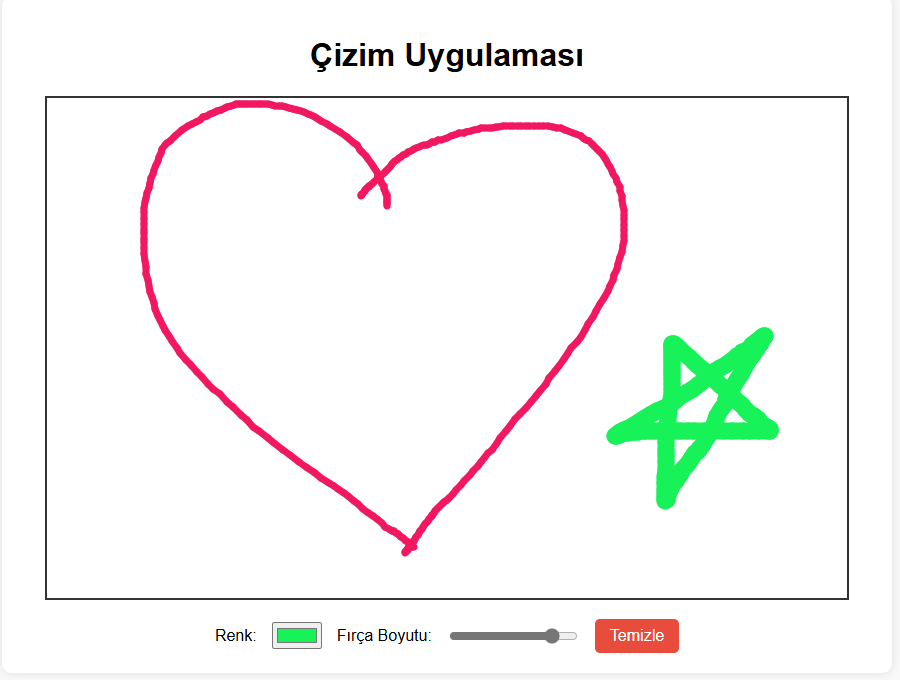

# 🎨 Çizim Uygulaması  
**English:** Canvas Drawing App

Bu proje, kullanıcıların fare ile serbestçe çizim yapabildikleri basit bir dijital tuval uygulamasıdır.

---

## 🎯 Projenin Amacı

- HTML5 Canvas API kullanarak çizim yapmak
- Fare hareketlerini takip edip çizgiler çizmek
- Renk ve fırça boyutunu dinamik olarak değiştirmek
- Kullanıcı deneyimini artırmak için tuvali temizleme fonksiyonu eklemek

---

## 🚀 Özellikler

- Serbest çizim imkanı
- Renk seçici ile farklı renklerde çizim
- Fırça kalınlığı ayarı
- Tuvali temizleme butonu

---

## 🛠️ Kullanılan Teknolojiler

- HTML5 (Canvas)  
- CSS3  
- JavaScript (Canvas API, Event Listeners)

---

---

## 👥 Ekip / Kaynaklar

- Geliştirici: [ Quenn Exe ]
- Kaynaklar:
  - [Canvas API - MDN](https://developer.mozilla.org/en-US/docs/Web/API/Canvas_API)
  - [HTML5 Canvas Tutorials](https://www.w3schools.com/html/html5_canvas.asp)

---

## 📌 Kazanımlar

- Canvas ile 2D grafik çizme yeteneği
- Fare olayları (mousedown, mousemove, mouseup) yönetimi
- Dinamik kullanıcı girdisi ile interaktif uygulama geliştirme

> 🎨 Bu proje, yaratıcı uygulamalar yapabilme becerisini güçlendirir ve görsel programlama konusunda önemli bir adım sağlar.

#🖼️ Arayüz Görünümü,

|  |